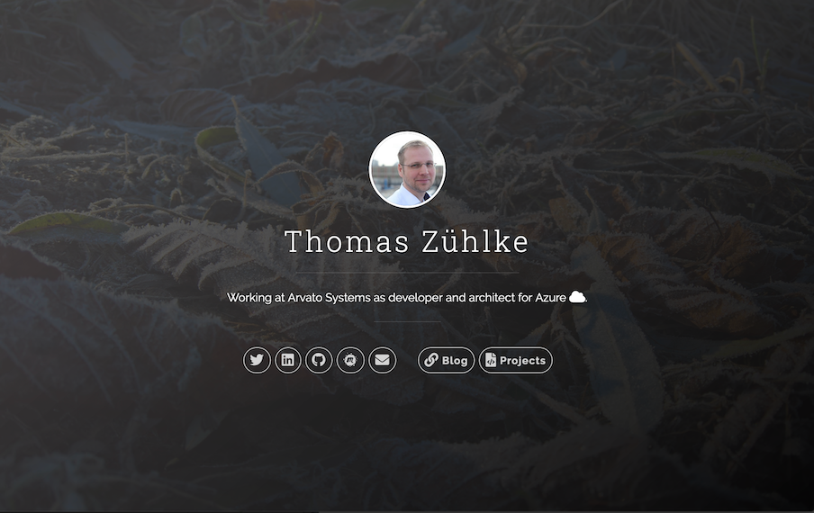

# Jekyll-Uno with Projects as Timeline
A Jekyll Theme, based on the Uno-Theme with a list of projects as Timeline.
원본 [https://github.com/tzuehlke/jekyll-uno-timeline]
데모 [Demo](http://thomas.zuehlke.family/)

## Changes
  * timeline information source is now `_data/projects.yaml`
    
## 보이는 화면
[URL 주소](https://jinsun-lee.github.io)

